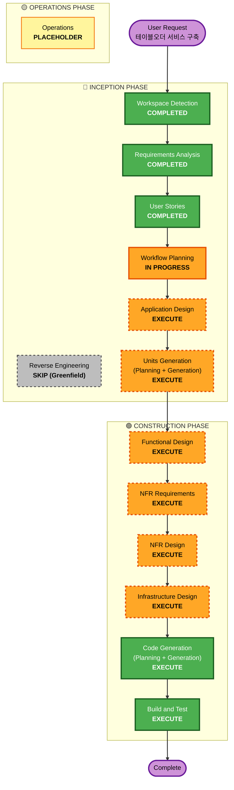

# Execution Plan - 테이블오더 서비스

**작성일**: 2026-08-31
**프로젝트 유형**: Greenfield (신규 구축)
**상태**: 검토 대기 (Review Pending)

---

## Detailed Analysis Summary (상세 분석 요약)

### Transformation Scope
- **해당 없음** (Greenfield - 기존 시스템 변환이 아닌 신규 구축)

### Change Impact Assessment (변경 영향 평가)

| 영향 영역 | 해당 여부 | 설명 |
|----------|---------|------|
| **User-facing changes** | ✅ Yes | 고객용 UI (태블릿) + 관리자용 UI (대시보드) 신규 구축 |
| **Structural changes** | ✅ Yes | 전체 시스템 아키텍처 신규 설계 (Frontend + Backend + DB) |
| **Data model changes** | ✅ Yes | 9개 엔티티 신규 설계 (Store, Admin, Table, Menu, Order 등) |
| **API changes** | ✅ Yes | REST API + SSE 엔드포인트 전체 신규 정의 |
| **NFR impact** | ✅ Yes | 성능(<2초), 실시간(SSE), 세션 관리, 오프라인 지원 |

### Component Relationships
- **해당 없음** (Greenfield - 기존 컴포넌트 의존성 그래프 없음)

### Risk Assessment (위험 평가)
- **Risk Level**: **Medium (중간)**
  - 근거: 여러 컴포넌트 + 실시간 SSE 통신 + 세션 관리의 복잡도, 단 MVP 범위가 명확히 정의됨
- **Rollback Complexity**: Easy (신규 프로젝트, 프로토타입 단계)
- **Testing Complexity**: Moderate (속성 기반 테스팅으로 주문/결제 정합성 검증 필요)

---

## Workflow Visualization

---

## Phases to Execute (실행할 단계)

### 🔵 INCEPTION PHASE

- [x] **Workspace Detection** (COMPLETED)
  - Greenfield 프로젝트 확인 완료

- [x] **Reverse Engineering** (SKIPPED)
  - **Rationale**: Greenfield 프로젝트로 기존 코드 없음

- [x] **Requirements Analysis** (COMPLETED)
  - 요구사항 문서 및 검증 질문 완료

- [x] **User Stories** (COMPLETED)
  - 21개 User Stories, 2개 Personas, Story Matrix 완료

- [x] **Workflow Planning** (IN PROGRESS)
  - 현재 단계

- [ ] **Application Design** - **EXECUTE**
  - **Rationale**: 신규 컴포넌트/서비스 대량 필요. Frontend(React) + Backend(FastAPI) 컴포넌트 구조, 서비스 레이어, 비즈니스 규칙(주문 상태 전이, 세션 관리) 정의 필요

- [ ] **Units Generation** - **EXECUTE**
  - **Rationale**: 신규 데이터 모델 9개, REST API + SSE 엔드포인트, 복잡한 비즈니스 로직(주문 정합성, 세션 격리, 자동 재시도), 상태 관리(localStorage + JWT) 존재

### 🟢 CONSTRUCTION PHASE

- [ ] **Functional Design** - **EXECUTE**
  - **Rationale**: 각 Unit의 기능 상세 설계 필요 (주문 흐름, SSE 브로드캐스트, 세션 종료 트랜잭션)

- [ ] **NFR Requirements** - **EXECUTE**
  - **Rationale**: 명확한 성능 요구사항(주문<1초, 메뉴<2초, SSE<2초), 오프라인 지원, 세션 만료(16시간) 등 NFR 존재

- [ ] **NFR Design** - **EXECUTE**
  - **Rationale**: 실시간 통신(SSE) 설계, 오프라인 캐싱 전략, 세션 격리 설계 필요

- [ ] **Infrastructure Design** - **EXECUTE**
  - **Rationale**: Docker Compose 환경, PostgreSQL 컨테이너, 개발 환경 인프라 정의 필요

- [ ] **Code Generation** - **EXECUTE (ALWAYS)**
  - **Rationale**: 구현 계획 및 코드 생성 필요

- [ ] **Build and Test** - **EXECUTE (ALWAYS)**
  - **Rationale**: 빌드, 테스트, 검증 필요. 속성 기반 테스팅(Property-Based Testing) 활성화됨 - 주문/결제 로직 정합성 검증

### 🟡 OPERATIONS PHASE

- [ ] **Operations** - **PLACEHOLDER**
  - **Rationale**: 향후 배포 및 모니터링 워크플로우 (현재 범위 외)

---

## Extension 적용 계획

| Extension | 상태 | 적용 단계 |
|-----------|------|---------|
| **Security Baseline** | ❌ Disabled | - (프로토타입) |
| **Resiliency Baseline** | ❌ Disabled | - (프로토타입) |
| **Property-Based Testing** | ✅ Enabled | Build and Test 단계에서 주문/결제 정합성 검증 |

---

## Estimated Timeline (예상 일정)

- **총 실행 단계**: 8개 (Application Design → Build and Test)
- **INCEPTION 잔여**: Application Design, Units Generation (2개)
- **CONSTRUCTION**: Functional Design, NFR Requirements, NFR Design, Infrastructure Design, Code Generation, Build and Test (6개)
- **예상 소요**: Sprint 1 (MVP, 19개 스토리) 중심으로 진행

---

## Success Criteria (성공 기준)

- **Primary Goal**: 테이블오더 MVP 서비스 구축 (고객 태블릿 + 관리자 대시보드 + 서버 + DB)
- **Key Deliverables**:
  - Application Design 문서
  - Units 정의 (데이터 모델, API, 컴포넌트)
  - FastAPI 백엔드 코드
  - React 프론트엔드 코드 (고객 + 관리자)
  - PostgreSQL 스키마
  - Docker Compose 환경
  - 속성 기반 테스트
- **Quality Gates**:
  - ✅ 모든 요구사항 커버 (requirements.md 대비)
  - ✅ 21개 User Stories의 Acceptance Criteria 충족
  - ✅ 성능 기준 충족 (주문<1초, 메뉴<2초, SSE<2초)
  - ✅ 속성 기반 테스트 통과 (주문/결제 정합성)
  - ✅ DoD 충족: 코드 작성, Unit Test, Code Review, Integration Test, PO 승인

---

**작성일**: 2026-08-31
**상태**: 검토 대기
**다음 단계**: Application Design (승인 후 진행)
